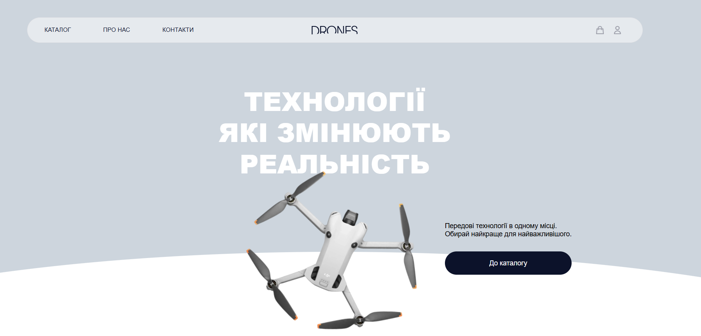
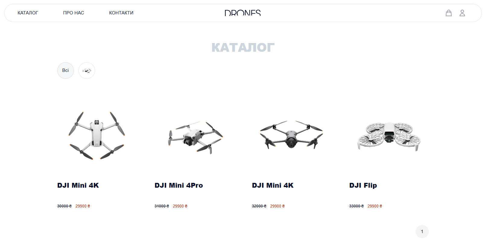
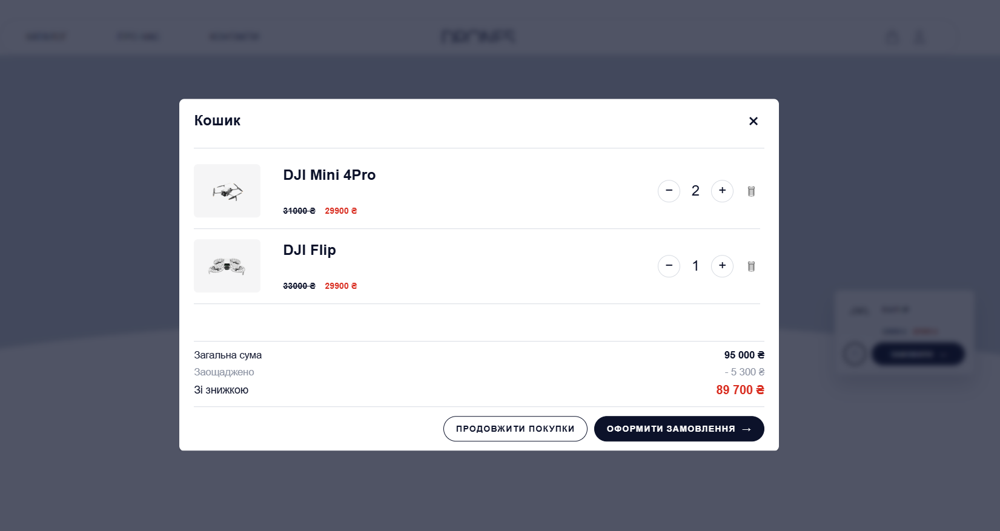
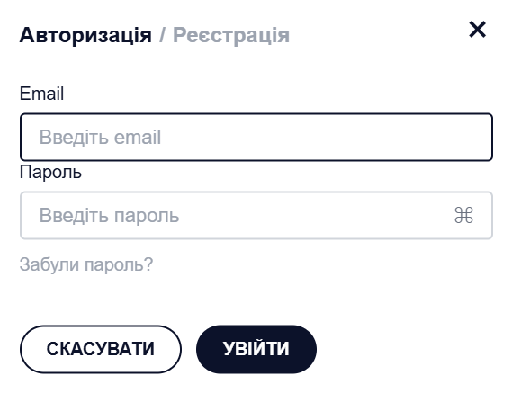
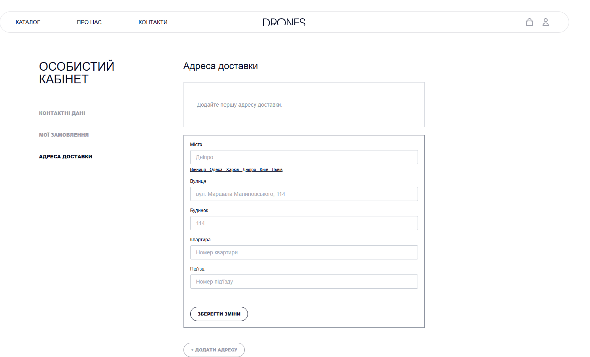
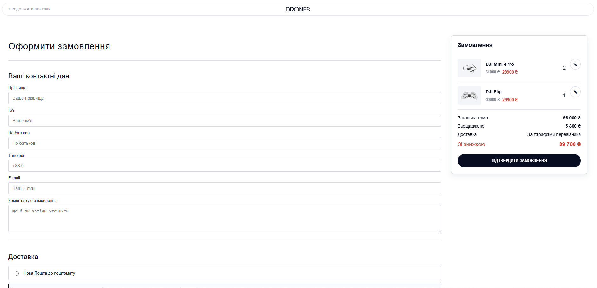

# Drone Shop

## English

### 1. Project Purpose

Drone Shop is a small training web shop made with Flask. The main idea of the project is to practice how a real online store can be built: product catalog, product page, cart, order form, login, registration and a simple user dashboard.

For a beginner developer this project is useful because it has several connected parts, but it is still not too big. While working with it, it is possible to learn how Flask blueprints work, how templates are rendered, how data is saved in SQLite, and how frontend JavaScript can communicate with backend routes.

### 2. README Navigation

- [Project Purpose](#1-project-purpose)
- [README Navigation](#2-readme-navigation)
- [Modules and Technologies](#3-modules-and-technologies)
- [How to Run the Project](#4-how-to-run-the-project)
- [Project Structure and Apps](#5-project-structure-and-apps)
- [Conclusion](#6-conclusion)

### 3. Modules and Technologies

Main technologies used in the project:

- **Python** - main programming language.
- **Flask** - backend framework for routes, templates and app setup.
- **Flask Blueprints** - used to split the project into smaller apps.
- **Jinja2** - templates for HTML pages.
- **Flask-SQLAlchemy** - database work through models.
- **SQLite** - local database, stored in `Project/Project/instance/data.db`.
- **Flask-Migrate / Alembic** - database migrations.
- **Flask-Login** - user sessions and authorization.
- **Flask-Mail** - email verification during registration.
- **Requests** - used for external API calls in the order flow.
- **HTML, CSS, JavaScript** - frontend pages, modals, catalog filtering, cart actions and dashboard interactions.


### 4. How to Run the Project

1. Clone or open the project folder.

2. Create a virtual environment:

```powershell
python -m venv venv
```

3. Activate it on Windows:

```powershell
venv\Scripts\Activate.ps1
```

4. Install dependencies:

```powershell
pip install -r requirements.txt
```

5. Create a root `.env` file if it is not created yet. The app expects these variables:

```env
SECRET_KEY=your-secret-key
MAIL=your-email@gmail.com
PASSWORD=your-email-app-password
DB_INIT=flask --app Project:project db init
DB_MIGRATE=flask --app Project:project db migrate -m "initial"
DB_UPGRADE=flask --app Project:project db upgrade
```

For some checkout features the code can also use external API tokens:

```env
NOVA_POST_TOKEN=your-nova-post-token
MONOBANK_TOKEN=your-monobank-token
```

6. Start the development server:

```powershell
python Project\manage.py
```

7. Open the app in the browser:

```text
http://localhost:8000
```

### 5. Project Structure and Apps

General project structure:

```text
drone-shop/
├── Project/
│   ├── manage.py
│   ├── Project/
│   │   ├── settings.py
│   │   ├── urls.py
│   │   ├── db.py
│   │   ├── migrations/
│   │   ├── templates/
│   │   └── static/
│   ├── home/
│   ├── catalog/
│   ├── cart/
│   ├── order/
│   ├── dashboard/
│   └── user/
├── requirements.txt
└── README.md
```

Main project parts:

- **Project/manage.py** - starts the Flask app on port `8000`.
- **Project/Project/** - common app setup: Flask object, database connection, routes, migrations, login manager, base template and global static files.
- **home** - home page, contacts page and about page.
- **catalog** - product catalog, product pages, filtering, product details and admin product creation.
- **cart** - cart page and cart modal. Products are saved in browser cookies.
- **order** - order page, payment logic and delivery warehouse loading.
- **dashboard** - user account page with contact data, delivery addresses and user orders.
- **user** - login, registration, logout and email verification.

```markdown






```

### 6. Conclusion

This project was useful as practice with a Flask web application that has more than one page and more than one model. It helped to understand routes, templates, user login, cart logic, database models and simple admin actions.

In the future, the project can be improved by adding better validation, more stable payment and delivery handling.

---

## Українська

### 1. Мета створення проєкту

Drone Shop - це невеликий навчальний інтернет-магазин дронів, зроблений на Flask. Головна ідея проєкту - потренуватися у створенні сайту, де є каталог товарів, сторінка товару, кошик, оформлення замовлення, вхід, реєстрація та особистий кабінет користувача.

Для початківця цей проєкт корисний тим, що він вже має кілька пов'язаних частин, але ще не виглядає занадто складним. Під час роботи з ним можна краще зрозуміти Flask Blueprints, шаблони Jinja, роботу з SQLite, міграції бази даних і просту взаємодію JavaScript з backend-маршрутами.

### 2. Зміст файлу README

- [Мета створення проєкту](#1-мета-створення-проєкту)
- [Зміст файлу README](#2-зміст-файлу-readme)
- [Перелік модулів та технологій](#3-перелік-модулів-та-технологій)
- [Як запустити проєкт в роботу](#4-як-запустити-проєкт-в-роботу)
- [Зміст проєкту](#5-зміст-проєкту)
- [Висновок по роботі](#6-висновок-по-роботі)

### 3. Перелік модулів та технологій

Основні технології та інструменти:

- **Python** - основна мова програмування.
- **Flask** - backend-фреймворк для сторінок, маршрутів і налаштування сайту.
- **Flask Blueprints** - допомагають розділити проєкт на окремі частини.
- **Jinja2** - шаблони для HTML-сторінок.
- **Flask-SQLAlchemy** - робота з базою даних через моделі.
- **SQLite** - локальна база даних у файлі `Project/Project/instance/data.db`.
- **Flask-Migrate / Alembic** - міграції бази даних.
- **Flask-Login** - авторизація користувачів і сесії.
- **Flask-Mail** - відправка коду підтвердження під час реєстрації.
- **Requests** - запити до зовнішніх API у частині замовлення.
- **HTML, CSS, JavaScript** - верстка сторінок, модальні вікна, фільтрація каталогу, кошик і особистий кабінет.

Окремої frontend-збірки тут немає. Файлу `package.json` у проєкті теж немає, тому стилі та скрипти підключаються як звичайні static-файли Flask.

### 4. Як запустити проєкт в роботу

1. Відкрити папку проєкту.

2. Створити віртуальне середовище:

```powershell
python -m venv venv
```

3. Активувати його у Windows:

```powershell
venv\Scripts\Activate.ps1
```

4. Встановити залежності:

```powershell
pip install -r requirements.txt
```

5. Створити файл `.env` у корені проєкту, якщо його ще немає. Для запуску потрібні такі змінні:

```env
SECRET_KEY=your-secret-key
MAIL=your-email@gmail.com
PASSWORD=your-email-app-password
DB_INIT=flask --app Project:project db init
DB_MIGRATE=flask --app Project:project db migrate -m "initial"
DB_UPGRADE=flask --app Project:project db upgrade
```

Для деяких функцій оформлення замовлення також можуть знадобитися токени зовнішніх сервісів:

```env
NOVA_POST_TOKEN=your-nova-post-token
MONOBANK_TOKEN=your-monobank-token
```

6. Запустити dev-сервер:

```powershell
python Project\manage.py
```

7. Відкрити сайт у браузері:

```text
http://localhost:8000
```

### 5. Зміст проєкту

Загальна структура:

```text
drone-shop/
├── Project/
│   ├── manage.py
│   ├── Project/
│   │   ├── settings.py
│   │   ├── urls.py
│   │   ├── db.py
│   │   ├── migrations/
│   │   ├── templates/
│   │   └── static/
│   ├── home/
│   ├── catalog/
│   ├── cart/
│   ├── order/
│   ├── dashboard/
│   └── user/
├── requirements.txt
└── README.md
```

Основні частини проєкту:

- **Project/manage.py** - запускає Flask-додаток на порту `8000`.
- **Project/Project/** - загальні налаштування додатку, підключення бази даних, маршрути, міграції, login manager, базовий шаблон і спільні static-файли.
- **home** - головна сторінка, сторінка контактів і сторінка про сайт.
- **catalog** - каталог товарів, сторінки товарів, фільтрація, деталі товару та проста адмін-сторінка для додавання товарів.
- **cart** - сторінка кошика і модальне вікно кошика. Товари зберігаються через cookies у браузері.
- **order** - сторінка оформлення замовлення, логіка оплати і завантаження відділень доставки.
- **dashboard** - особистий кабінет користувача з контактними даними, адресами доставки та замовленнями.
- **user** - вхід, реєстрація, вихід і підтвердження email-кодом.


```markdown


```

### 6. Висновок по роботі

Цей проєкт був корисний як практика створення Flask додатку, у якому є кілька сторінок, база даних, користувачі, кошик і замовлення. Під час роботи можна було навчитися краще розділяти код на модулі, працювати з моделями, шаблонами, формами та простими AJAX-запитами.

У майбутньому проєкт можна розвивати: покращити валідацію форм, зробити зручніше керування товарами.